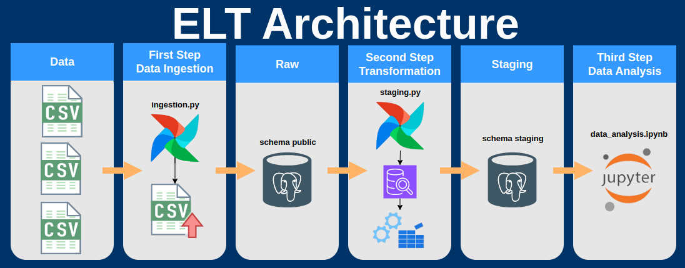

# Clever Data Engineer Trial Project

Hello everyone! For this project, I decided to focus on a more robust architecture by creating an ELT and using Postgres as a data lake with data layers.

The main DAG is [ingestion.py](dags/ingestion.py), but now there is a second DAG called [staging.py](dags/staging.py) that, as the name suggests, creates the second data layer, keeping only the tables that will be used for analysis, while also performing some basic transformations. To do this, I created some queries that perform these transformations and finally I performed the analyses in the [data_analysis.ipynb](notebooks/data_analysis.ipynb) notebook.

## Architecture

### First step - Data Ingestion
Data ingestion starts with [ingestion.py](dags/ingestion.py), which takes the list of CSVs and dumps them into the database in the public schema. This is the "raw" layer where the data has not been transformed. It is possible to use this data, but this makes analysis difficult because it still has a lot of noise, many useless columns, null data, wrong datatypes, among other things, so having a "staging" layer helps ensure better data quality.

### Second step - Data Transformation
Now, after the data is available in the database, it's time to choose which tables to use and make the basic transformations. For this, I'm using the DAG [staging.py](dags/staging.py) that uses the `run_sql()` function to run the queries that you can find in the `/data-trial/queries/` path.
The queries create the staging schema and the tables, in addition to making the necessary transformations.
For this project, I chose the tables
 - `company_profiles_google_maps`
 - `customer_reviews_google`

and the columns
 - `name`
 - `phone`
 - `site`
 - `business_status`
 - `category`
 - `city`
 - `state`
 - `review_rating`
 - `about`
 - `verified`
 - `reviews`
 - `review_text`
 - `review_datetime_utc`

Validations are mainly to avoid null data that I consider necessary. From the point of view of the end customer who is researching which company to hire, I also considered it necessary for the company to have a telephone number or website, be verified and the status be `"OPERATIONAL"` so that the customer can hire the company without problems.

> Note: this DAG uses an Airflow dataset, so whenever [ingestion.py](dags/ingestion.py) finishes this DAG will be triggered. This is good to ensure that even if there is a delay in the first DAG, the second one will not be triggered before time. But it is important to be aware of the following: If you clear any run of the mother DAG, the child DAG will be triggered again. In this case it does not cause any problems but it is good to be aware of this behavior.

### Third Step - Data Analysis

With the data already prepared for analysis, I read it in [data_analysis.ipynb](notebooks/data_analysis.ipynb), make the necessary joins and start it!\
The main idea of ​​the analysis is to find the best stores for the end consumer and what makes a store receive more reviews and be better rated.

### The End!
Thanks for the opportunity, I hope you liked this project! :smiley:

